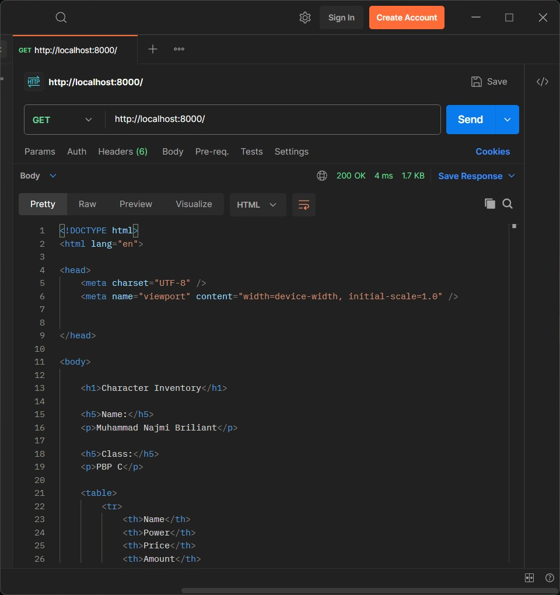
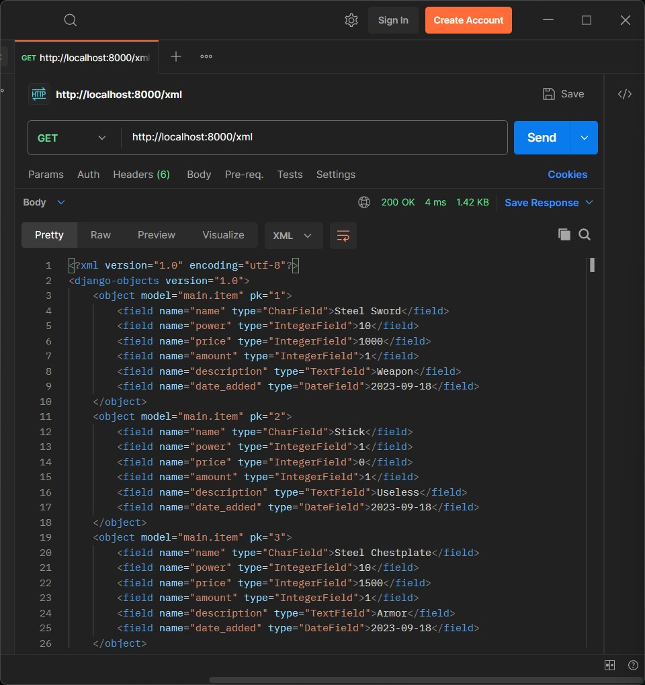
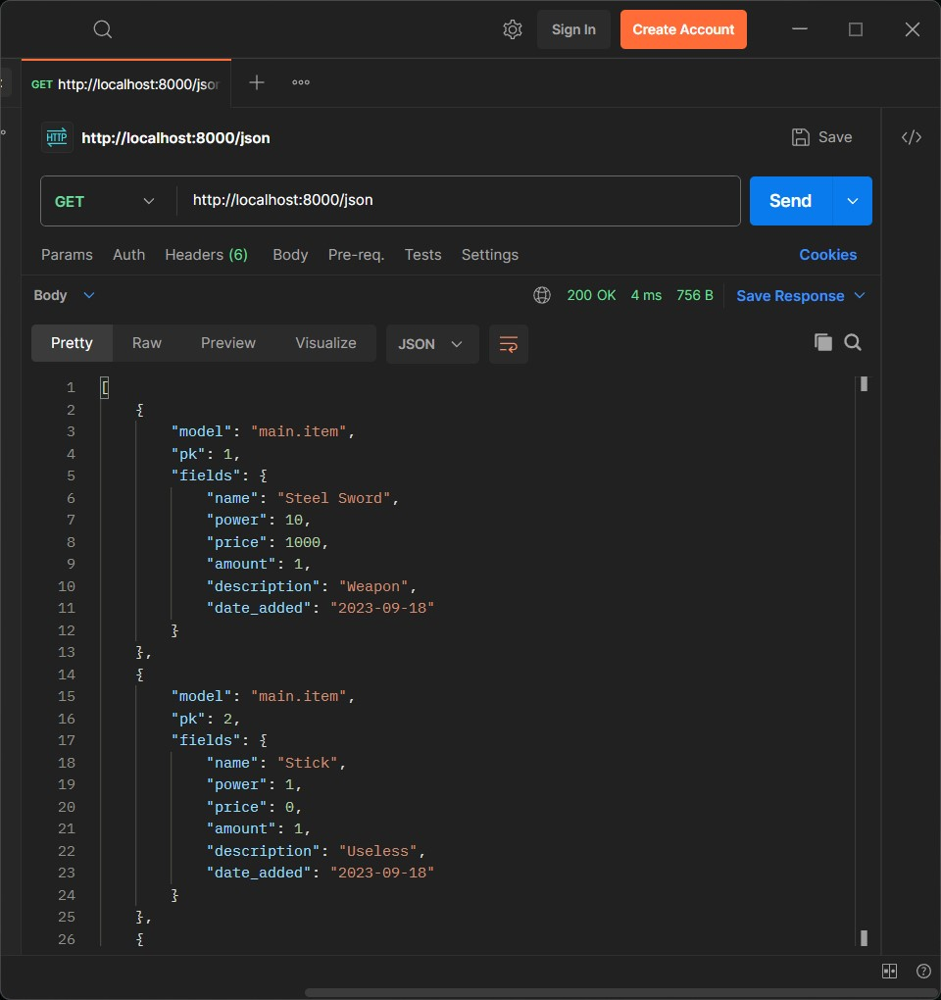
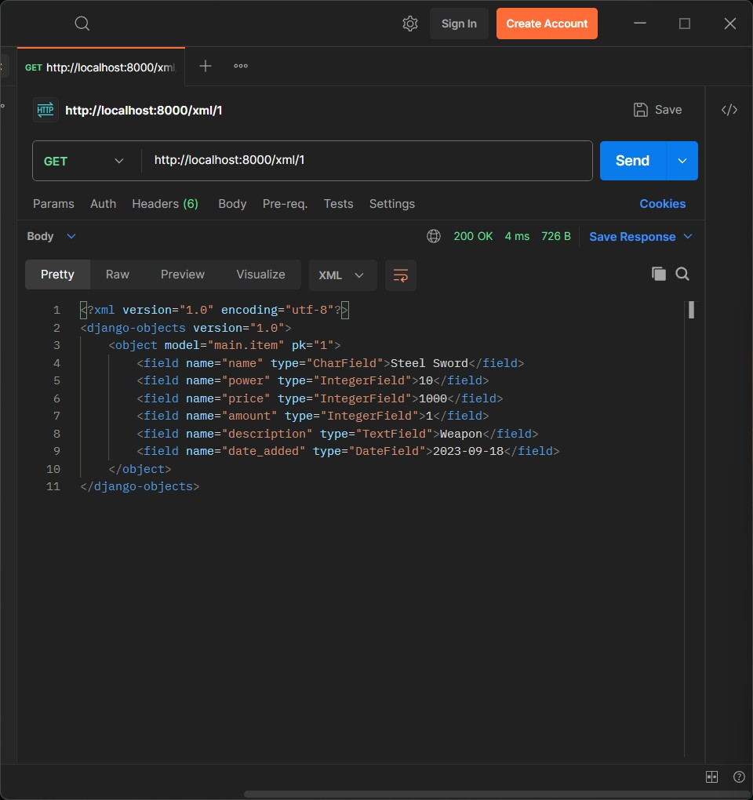
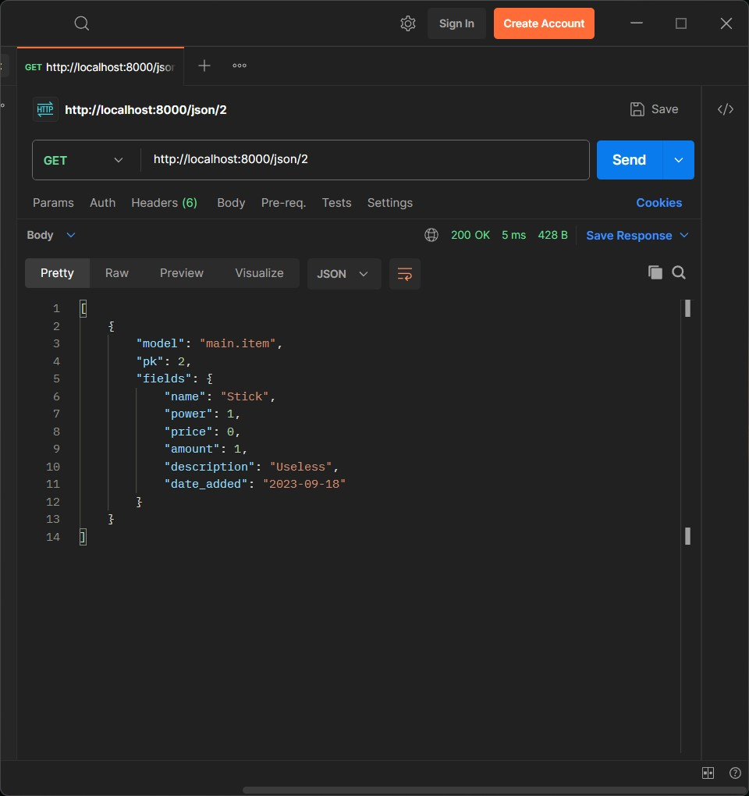

# Role-Playing-Games Inventory System

Muhammad Najmi Briliant (2206082820)
PBP C

## Tautan Aplikasi

[Link to Role-Playing-Games Inventory System](https://najmibriliant-rpginventory.adaptable.app)

## Tugas 4: Implementasi Autentikasi, Session, dan Cookies pada Django

> 1. Jelaskan bagaimana cara kamu mengimplementasikan checklist di atas secara step-by-step (bukan hanya sekadar mengikuti tutorial).

- [x] Mengimplementasikan fungsi registrasi, login, dan logout untuk memungkinkan pengguna untuk mengakses aplikasi sebelumnya dengan lancar.

    Developer membuat:
    - fungsi `register` menggunakan `UserCreationForm` untuk mengatur pembuatan akun pada website
    - fungsi `login_user` untuk meng-autentikasi `User`
    - fungsi `logout_user` untuk mengatur keluar dari halaman milik suatu `User`

    pada file `views.py` dan mendaftarkan path url pada list `urlpatterns` di file `main/urls.py` agar halaman bisa diakses melalui link. Setelah itu, developer menambahkan decorator `@login_required` pada fungsi `show_main` agar halaman hanya bisa diakses jika sudah login.

    Agar user dapat melihat data menggunakan format HTML, developer membuat template baru yaitu `register.html` untuk mendaftarkan `User` baru dan `login.html` untuk masuk ke halaman suatu `User`. Developer juga memodifikasi fungsi `show_main` dan template `main.html` agar `item` yang terlihat hanya yang dibuat oleh user tersebut. Pada `main.html` developer juga menambahkan tombol logout agar bisa keluar dari halaman suatu `User`.

- [x] Membuat dua akun pengguna dengan masing-masing tiga dummy data menggunakan model yang telah dibuat pada aplikasi sebelumnya untuk setiap akun di lokal.

    Developer membuat dua akun pada halaman `register` dengan detail:
    1. Username: Najmi , Password: najmibriliant
    2. Username: akun1 , Password: najmibriliant

    Setelah itu, developer membuat 3 `Item` untuk masing-masing `User` yang telah dibuat.

- [x] Menghubungkan model Item dengan User.

    Developer menghubungkan model `Item` dengan `User` agar untuk setiap `item` yang dibuat akan memiliki atribut `user` dan web bisa mengidentifikasikan item tersebut dibuat oleh siapa. Caranya adalah dengan menambahkan atribut `user` pada model `Item` dan menggunakan metode `ForeignKey` untuk menyambungkannya dengan model `User`. Setelah itu developer menambahkan filter user pada fungsi `show_main`, agar yang muncul hanya `Item` yang dibuat oleh suatu `user`. Terakhir, developer melakukan migration baru pada proyek, agar semua perubahan pada `models.py` tersimpan.

- [x] Menampilkan detail informasi pengguna yang sedang logged in seperti username dan menerapkan cookies seperti last login pada halaman utama aplikasi.

    Developer membuat beberapa modifikasi pada fungsi `show_main` dan template `main.html` agar halaman bisa menunjukan nama user yang sedang login dan juga kapan terakhir kali login. Pada fungsi `login_user`, developer menambahkan fungsi untuk menambahkan cookie yang bernama `last_login` untuk melihat kapan terakhir kali pengguna melakukan login. Lalu developer menambahkan data tersebut pada `context` di `show_main`. Developer juga menambahkan kode pada fungsi `logout_user` agar cookie `last_login` dihapus ketika user melakukan logout. Terakhir, developer menambahkan text pada template `main.html` untuk menunjukan kepada user, kapan terakhir kali login.

- [x] Melakukan `add`-`commit`-`push` ke GitHub.

> 2. Apa itu Django `UserCreationForm`, dan jelaskan apa kelebihan dan kekurangannya?

    `UserCreationForm` adalah salah satu bentuk form yang disediakan oleh Django untuk memudahkan proses pembuatan `user` baru dalam aplikasi web. Form ini digunakan untuk mengumpulkan informasi yang diperlukan dari `user` saat mereka mendaftar atau membuat akun baru di situs web Anda. Form ini biasanya digunakan bersama dengan model bawaan Django `User`, yang menyimpan informasi pengguna seperti username, password, email, dan lain-lain.

    Kelebihan dari menggunakan UserCreationForm dalam Django adalah:

        1. Sederhana untuk Digunakan: `UserCreationForm` menyediakan semua logika yang diperlukan untuk membuat formulir pendaftaran pengguna. Developer hanya perlu mengimpor dan menggunakannya dalam tampilan Django, tanpa perlu menulis kode form dari awal.

        2. Validasi Terintegrasi: Form ini memiliki validasi terintegrasi untuk memastikan bahwa informasi yang dimasukkan oleh pengguna sesuai dengan aturan yang ditentukan, seperti memeriksa kekuatan kata sandi, kelengkapan alamat email, dll.

        3. Kompatibilitas Dengan Model User: `UserCreationForm` dirancang untuk bekerja dengan model pengguna bawaan Django (User model). Ini membuatnya sangat mudah untuk mengintegrasikan pendaftaran pengguna dengan basis data Django.

    Namun, ada beberapa kekurangan yang perlu diperhatikan:

        1. Ketidakmemadanan Desain: Meskipun `UserCreationForm` memungkinkan developer untuk memulai dengan cepat, desain formulir ini perlu disesuaikan agar sesuai dengan tampilan dan tata letak pada situs web.

        2. Kustomisasi: Ketika developer memerlukan logika pendaftaran pengguna yang lebih kompleks atau fitur tambahan seperti validasi email, developer mungkin perlu menyesuaikan atau bahkan membuat form pendaftaran kustom yang memenuhi kebutuhan situs web.

        3. Keterbatasan Fungsionalitas: `UserCreationForm` adalah formulir standar yang hanya mengumpulkan beberapa informasi dasar. Jika developer memerlukan informasi tambahan dari pengguna saat pendaftaran, perlu ditambahkan bidang tambahan ke form atau membuat form kustom.

> 3. Apa perbedaan antara autentikasi dan otorisasi dalam konteks Django, dan mengapa keduanya penting?

    1. Autentikasi

        Autentikasi adalah proses verifikasi identitas pengguna, yaitu memastikan bahwa pengguna yang mengakses sistem atau aplikasi adalah orang yang sesuai. Hal ini dilakukan pada proses login, di mana pengguna harus memasukkan kredensial, seperti nama pengguna (username) dan kata sandi (password), untuk membuktikan bahwa mereka adalah pengguna yang sah. Autentikasi membantu mencegah akses tidak sah ke akun pengguna dengan memvalidasi identitas pengguna.

    2. Otorisasi

        Otorisasi adalah proses menentukan apa yang diizinkan atau tidak diizinkan oleh pengguna yang sudah diautentikasi. Ini berkaitan dengan hak akses atau izin yang dimiliki oleh pengguna dalam sistem. Setelah pengguna berhasil login, otorisasi akan menentukan apa yang bisa mereka lakukan dalam aplikasi, misalnya, apakah mereka dapat mengedit profil mereka, mengakses halaman tertentu, atau hanya dapat membaca konten. Otorisasi membantu menjaga keamanan data dan sumber daya dengan membatasi akses ke tindakan atau informasi tertentu sesuai dengan peran atau izin pengguna.

    Keduanya sangat penting dalam pengembangan aplikasi web karena autentikasi memastikan bahwa hanya pengguna yang sah yang dapat mengakses sistem. Sedangkan otorisasi memungkinkan pengembang untuk mengontrol apa yang dapat dilakukan oleh pengguna setelah mereka diautentikasi.

> 4. Apa itu cookies dalam konteks aplikasi web, dan bagaimana Django menggunakan cookies untuk mengelola data sesi pengguna?

    Cookies adalah sejenis data kecil yang disimpan di sisi klien (biasanya dalam browser web) oleh server aplikasi web saat pengguna berinteraksi dengan situs web. Cookies digunakan untuk menyimpan informasi tertentu yang dapat diakses oleh server kembali saat klien melakukan permintaan berikutnya. Dalam konteks aplikasi web, cookies digunakan untuk berbagai tujuan, termasuk manajemen sesi pengguna, penyimpanan preferensi pengguna,pelacakan aktivitas pengguna, dan tujuan lainnya.

> 5. Apakah penggunaan cookies aman secara default dalam pengembangan web, atau apakah ada risiko potensial yang harus diwaspadai?

    Penggunaan cookies dalam pengembangan web dapat aman jika diimplementasikan dengan benar dan dijaga dengan baik. Namun, ada beberapa risiko potensial yang perlu diwaspadai:

    Pelanggaran Privasi: Cookies dapat digunakan untuk melacak perilaku pengguna di seluruh situs web, dan dalam beberapa kasus, bahkan di seluruh internet. Ini dapat mengancam privasi pengguna jika data yang dikumpulkan atau cara cookies digunakan tidak diatur dengan baik. 

    Cross-Site Scripting (XSS): Jika suatu situs web rentan terhadap serangan XSS, penyerang dapat menyisipkan skrip berbahaya dalam cookie pengguna. Kemudian, skrip ini dapat dijalankan di browser pengguna saat mereka mengakses situs web tersebut, yang dapat mengancam keamanan pengguna.

    Cross-Site Request Forgery (CSRF): Cookies yang digunakan untuk autentikasi dan otorisasi dapat menjadi sasaran serangan CSRF jika tidak diatur dengan benar. Serangan CSRF dapat memengaruhi pengguna yang sudah diautentikasi dan mengizinkan penyerang melakukan tindakan atas nama pengguna tersebut tanpa izin.

## Tugas 3: Implementasi Form dan Data Delivery pada Django

> 1. Apa perbedaan antara form POST dan form GET dalam Django?

Dalam form POST, data dikirimkan dalam tubuh permintaan HTTP, yang berarti data tidak terlihat dalam URL. Hal ini cocok untuk mengirim data yang bersifat rahasia atau sensitif karena tidak mudah dilihat oleh pengguna. Form POST lebih cocok untuk pengiriman data sensitif seperti kata sandi atau informasi pribadi. Pada form POST, tidak ada batasan praktis pada panjang data yang dapat dikirimkan menggunakan metode POST. Penggunaannya form POST adalah untuk mengirim data yang akan diolah oleh server, seperti mengirim formulir, mengirim permintaan AJAX, atau membuat perubahan di server (seperti menambahkan, mengedit, atau menghapus data).

Pada form GET, data dikirimkan sebagai bagian dari URL. Data muncul di dalam string query URL dan dapat dilihat oleh semua orang yang melihat URL tersebut. Ini cocok untuk permintaan yang tidak memiliki efek samping dan hanya membaca data. Form GET menjadi pilihan yang tidak aman apabila ingin mengirim data sensitif. Pada form GET juga terdapat batasan pada panjang URL yang dapat ditangani oleh browser dan server, sehingga tidak cocok untuk mengirim data yang sangat besar. Metode GET digunakan untuk mengambil data dari server, seperti menampilkan halaman web, pencarian, atau mengirim parameter dalam URL.

Referensi:
https://www.w3schools.com/tags/ref_httpmethods.asp 

> 2. Apa perbedaan utama antara XML, JSON, dan HTML dalam konteks pengiriman data?
1. XML (eXtensible Markup Language)
XML menggunakan sintaksis yang ketat dan deklarasi struktur data dalam bentuk tag untuk mendefinisikan elemen dan hierarki. Format ini digunakan dalam berbagai aplikasi, termasuk konfigurasi, pertukaran data, SOAP (Simple Object Access Protocol) dalam layanan web, dan lain-lain. XML memiliki dukungan yang kuat untuk validasi skema, komentar, dan metadata.

2. JSON (JavaScript Object Notation)
JSON digunakan untuk pertukaran data dan representasi struktur data seperti XML, tetapi dalam format yang lebih ringkas dan mudah dibaca oleh manusia dan diproses oleh mesin. JSON menggunakan format yang lebih ringkas dengan objek yang mudah dibaca dan dihasilkan oleh banyak bahasa pemrograman. Format JSON digunakan dalam berbagai aplikasi, termasuk RESTful API, komunikasi antara server dan klien web, konfigurasi, dan pertukaran data antar bahasa pemrograman. JSON tidak memiliki dukungan untuk validasi skema seperti XML, tetapi itu membuatnya lebih sederhana dan efisien dalam penggunaan sehari-hari.

3. HTML (Hypertext Markup Language)
HTML digunakan untuk membuat tampilan halaman web dan menentukan bagaimana elemen-elemen tampil di browser web. HTML menggunakan sintaksis mirip XML, berisi tag yang mendefinisikan elemen-elemen seperti judul, paragraf, gambar, dan tautan dalam sebuah dokumen web. HTML memiliki kemampuan untuk membuat tampilan grafis yang interaktif di browser dan sering digunakan bersama dengan CSS (Cascading Style Sheets) dan JavaScript untuk membuat pengalaman pengguna yang kaya di web.

> 3. Mengapa JSON sering digunakan dalam pertukaran data antara aplikasi web modern?
JSON sering digunakan dalam pertukaran data antara aplikasi web modern karena beberapa alasan, yaitu:
- Sintaksis JSON mudah dibaca oleh manusia dan ringkas
- JSON memiliki ukuran data yang kecil, sehingga mengurangi beban jaringan
- Bisa digunakan dengan hampir semua bahasa pemrograman
- Mendukung data bersarang dan struktur data kompleks
- Mendukung pembaruan parsial, efisien dalam penggunaan bandwidth
- Standar dalam desain RESTful API, memudahkan integrasi antar layanan web
- Dokumentasi JSON tersedia di banyak bahasa, sehingga memudahkan pengembangan

> 4. Jelaskan bagaimana cara kamu mengimplementasikan checklist di atas secara step-by-step (bukan hanya sekadar mengikuti tutorial).

- [x] Membuat input `form` untuk menambahkan objek model pada app sebelumnya.

Sebelum developer mengimplementasikan `Skeleton` sebagai kerangka `Views`, pertama developer mengubah fungsi `urlpatterns` pada `urls.py` terlebih dahulu dengan mengubah path `main/` menjadi ``.

Selanjutnya, developer membuat folder `templates` pada root folder yang berisi `base.html`. File tersebut akan digunakan selanjutnya sebagai template untuk semua file HTML pada app ini. Agar `templates` terdaftar pada proyek, developer menambah `BASE_DIR` pada variabel `TEMPLATES` pada file `settings.py`. Setelah itu, developer mengubah isi `main.html` agar bisa di integrasikan dengan template pada `base.html`.

Setelah file HTML sudah disesuaikan, baru developer bisa membuat form input data, untuk menampilkan data item pada HTML. Developer membuat file `forms.py` pada folder `main` agar proyek bisa menerima data `item` baru. Pada file tersebut, developer menggunakan objek `Item` yang di-import dari file `models` dan membuat class `ItemForm`. Developer mengisi list `fields` pada `ItemForm` dengan `String` nama-nama atribut yang akan di input user ketika membuat `Item` ("name", "power", "price", "amount", "description"). Setelah itu, developer mengimport `ItemForm` dari file `forms.py` ke file `views.py` dan beberapa import lainnya. Import tersebut digunakan pada fungsi `create_item` yang akan menghasilkan formulir yang dapat menambahkan data produk secara otomatis ketika data di-submit dari form. 

Selanjutnya, developer mengubah fungsi `show_main` pada file `views.py` dengan menambahkan variabel `items` dengan value `Item.objects.all()` yang akan mengambil semua instance dari objek `Item` pada database. Lalu, `items` dimasukan ke dictionary `context`. Developer lalu meng-import fungsi `create_item` ke `urls.py` pada folder `main` dan menambahkan path url-nya ke dalam `urlpatterns`. Setelah url sudah ditambahkan, developer membuat file `create_item.html` pada folder `main/templates` untuk menampilkan form pembuatan item ke user. Terakhir, developer menambahkan kode ke `main.html` untuk menampilkan tabel yang berisi `item` yang dibuat oleh user.

- [x] Tambahkan 5 fungsi `views` untuk melihat objek yang sudah ditambahkan dalam format HTML, XML, JSON, XML by ID, dan JSON by ID.

Pada tahap ini, developer membuat fungsi views yang akan digunakan untuk melihat data yang telah disimpan dalam app. Data bisa dilihat menggunakan format HTML, XML, JSON. Untuk format XML dan JSON bisa melihat objek spesifik menggunakan ID. Pertama, developer meng-import `HttpResponse`, agar bisa mengembalikan response ke web, dan `serializers`, agar bisa mengembalikan data dengan format yang sesuai.

Setelah itu, developer baru membuat 4 fungsi, selain `show_main` (untuk melihat dalam format HTML) yaitu `show_xml`, `show_json`, `show_xml_by_id`, dan `show_json_by_id`. Ke-4 fungsi tersebut me-return `HttpResponse` dengan parameter yang sesuai. Format data disesuaikan menggunakan method `serialize`.

- [x] Membuat routing URL untuk masing-masing `views` yang telah ditambahkan pada poin 2.

Untuk semua fungsi `show` yang ditambahkan, jangan lupa untuk meng-import fungsi tersebut ke `urls.py` pada folder `main`. Setelah di import, tambahkan `path` ke `urlpatterns`. Sekarang, user bisa mengakses URL dengan format HTML, XML, dan JSON menggunakan Postman ataupun browser.

- [x] Mengakses kelima URL di poin 2 menggunakan Postman, membuat screenshot dari hasil akses URL pada Postman, dan menambahkannya ke dalam README.md.

1. HTML

2. XML

3. JSON

4. XML by ID

5. JSON by ID

- [x] Melakukan `add`-`commit`-`push` ke GitHub.

## Tugas 2: Implementasi MVT Model pada Django

> 1.  Jelaskan bagaimana cara kamu mengimplementasikan checklist di atas secara step-by-step (bukan hanya sekadar mengikuti tutorial).

- [x] Membuat sebuah proyek Django baru.

Sebelum meng-inisialisasi aplikasi, developer pertama membuat direktori lokal bernama `rpg_inventory` dan repositori GitHub terlebih dahulu. Direktori lokal tersebut dihubungkan dengan repositori menggunakan perintah `git branch -M main` untuk membuat main branch dan perintah `git remote add origin <URL_REPO>` untuk menghubungkan direktori lokal dengan repositori GitHub.
Setelah kedua repositori terhubung, developer membuat virtual environment pada direktori lokal dengan menggunakan perintah `python -m venv env`. Setelah virtual environment dibuat, dapat diaktifkan dengan perintah `env\Scripts\activate.bat`. Pada direktori utama, perlu ditambahkan file `requirements.txt` yang menjadi daftar dependensi dari proyek ini. Dependensi tersebut harus di-install pada direktori proyek dengan perintah `pip install -r requirements.txt`. Terakhir, proyek dapat dibuat dengan menjalankan perintah `django-admin startproject rpg_inventory .`.

- [x] Membuat aplikasi dengan nama `main` pada proyek tersebut.

Setelah proyek selesai dibuat, developer dapat membuat direktori main di dalam direktori utama dengan menjalankan perintah `python manage.py startapp main`. Folder tersebut berfungsi sebagai struktur inti dari proyek ini. Developer juga mendaftarkan folder main ke dalam proyek dengan menambahkan `main` dalam variabel `INSTALLED_APPS` dalam file `settings.py`.

- [x] Melakukan _routing_ pada proyek agar dapat menjalankan aplikasi `main`.

Developer menambahkan path ke dalam variabel `urlpatterns` pada `urls.py` agar rute URL aplikasi `main` terdefinisi. Path terdiri dari route, function pada `views.py` , dan parameter name. Lalu, developer mengkonfigurasi routing URL proyek dengan menambahkan path yang terdiri dari route dan fungsi include ke dalam variabel `urlpatterns`. Fungsi include berfungsi untuk mengimpor rute URL aplikasi `main` ke dalam file urls.py proyek.

- [x] Membuat model pada aplikasi `main` dengan nama `Item` dan memiliki atribut wajib sebagai berikut.

- `name` sebagai nama _item_ dengan tipe `CharField`.
- `amount` sebagai jumlah _item_ dengan tipe `IntegerField`.
- `description` sebagai deskripsi _item_ dengan tipe `TextField`.

Selain atribut wajib, developer juga telah menambahkan beberapa atribut tambahan seperti:

- `price` sebagai harga _item_ dengan tipe `IntegerField`.
- `power` sebagai kekuatan yang dimiliki _item_ dengan tipe `IntegerField`.
- `category` sebagai jenis _item_ dengan tipe `CharField`.

- [x] Membuat sebuah fungsi pada `views.py` untuk dikembalikan ke dalam sebuah _template_ HTML yang menampilkan nama aplikasi serta nama dan kelas kamu.

Developer meng-import function `render` agar bisa melakukan rendering terhadap tampilan `main.html`. Lalu dilanjutkan dengan mendeklarasikan function `show_main` dengan parameter request. Setelah itu, developer menambahkan data `name` dan `category` dalam fungsi `show_main`. Function di atas me-return `render(request, "main.html", context)` untuk menampilkan html pada web server.

- [x] Membuat sebuah _routing_ pada `urls.py` aplikasi `main` untuk memetakan fungsi yang telah dibuat pada `views.py`.

Di tahap ini, developer meng-import `path` dari `django.urls` dan fungsi `show_app_name` dari file `views.py`. Lalu, developer mengubah variabel `app_name` menjadi `main`. Setelah itu developer menambahkan path yang berisi route, fungsi `show_main`, dan parameter name pada variabel `urlpatterns`.

- [x] Melakukan _deployment_ ke Adaptable terhadap aplikasi yang sudah dibuat sehingga nantinya dapat diakses oleh teman-temanmu melalui Internet.

Setelah kerangka dasar aplikasi selesai dibuat, developer melakukan push semua perubahan yang telah dilakukan ke dalam repositori di `rpg_inventory` di GitHub. Menggunakan fitur source control pada GitHub, komentar, commit dan push dapat dengan mudah dilakukan. Setelah perubahan di push ke GitHub, developer dapat mendeploy aplikasi menggunakan Adaptable.io. Dalam hoster tersebut, developer menghubungkan repositori `rpg_inventory` dengan applikasi, memilih `Python App Template` dan `PostgreSQL` sebagai database. Developer juga menyesuaikan versi python menjadi 3.10, dan menerapkan perintah `python manage.py migrate && gunicorn najmibriliant-rpginventory.wsgi` di bagian start command. Terakhir, developer mencentang opsi `HTTP Listener on PORT` dan mendeploy aplikasi

> 2.  Buatlah bagan yang berisi request client ke web aplikasi berbasis Django beserta responnya dan jelaskan pada bagan tersebut kaitan antara urls.py, views.py, models.py, dan berkas html.

> 3.  Jelaskan mengapa kita menggunakan virtual environment? Apakah kita tetap dapat membuat aplikasi web berbasis Django tanpa menggunakan virtual environment?
Terdapat beberapa alasan mengapa developer menggunakan virtual environment untuk mendevelop aplikasi web berbasis Django, yaitu:

- Virtual environment digunakan untuk mengelola dan meng-encapsulate dependensi proyek agar terisolasi dan tidak mempengaruhi proyek lainnya yang mungkin menggunakan versi Django berbeda. Virtual environment juga memungkinkan developer untuk meng-install dan mengelola dependensi proyek secara terpisah dari dependensi proyek lain.

- Virtual environment memberikan kemudahan bagi developer dalam mengelola dan mengganti versi paket. Developer dapat mengaktifkan atau menonaktifkan virtual environment sesuai kebutuhan proyek, dan dapat menghapusnya jika proyek sudah selesai.

Penggunaan virtual environment sangat direkomendasikan dalam pengembangan Django, sebenarnya pembuatan aplikasi web berbasis Django tanpa menggunakan virtual environment bisa dilakukan. Namun, ini bisa menjadi praktik yang tidak dianjurkan karena mengelola dependensi dan isolasi proyek akan menjadi lebih rumit dan kurang terstruktur. Virtual environment membantu menjaga kebersihan dan kerapihan dalam pengembangan web dengan Django dan membuatnya lebih mudah untuk mengelola proyek-proyek yang berbeda dalam lingkungan Python yang bersih dan terisolasi.

> 4.  Jelaskan apakah itu MVC, MVT, MVVM dan perbedaan dari ketiganya.
MVC (Model-View-Controller), MVT (Model-View-Template), dan MVVM (Model-View-ViewModel) adalah tiga pola arsitektur perangkat lunak yang berbeda yang digunakan dalam pengembangan aplikasi. Mereka memiliki beberapa persamaan konseptual, tetapi ada perbedaan signifikan dalam cara mereka mengorganisasi kode dan aliran data dalam aplikasi.

Konsep dasarnya tetap menggunakan komponen berikut:

- Model: Representasi dari data dan logika bisnis dalam aplikasi. Model mengelola data, mengelola pembaruan, dan memberi tahu View tentang perubahan data.

- View: Bertanggung jawab untuk menampilkan data kepada pengguna dan mengirim masukan pengguna ke Controller. View tidak memiliki pengetahuan tentang data atau logika bisnis, hanya tampilan yang digambarkan.

Tetapi terdapat perbedaan dalam pengelolaan input dan tampilan, yaitu pada komponen:

- Controller: Menerima masukan dari pengguna dan mengkoordinasikan dengan Model dan View. Controller mengelola aliran logika bisnis dan memutuskan tampilan mana yang harus diperbarui.

- Template: Merupakan tampilan dalam Django, yang digunakan untuk merender data dari Model menjadi HTML yang akan ditampilkan kepada pengguna. Template berisi kode HTML dengan penambahan sintaksis Django untuk menyisipkan data dinamis.

- ViewModel: Bertindak sebagai perantara antara Model dan View. Ini adalah komponen yang mengambil data dari Model dan memformatnya agar dapat ditampilkan dengan mudah oleh View. ViewModel juga merespons perintah dari View dan mengubah Model sesuai kebutuhan.

Singkatnya, MVC, MVT, dan MVVM adalah tiga pola arsitektur yang berbeda dengan konsep dasar yang serupa dalam memisahkan tampilan, logika bisnis, dan data. Perbedaan utama terletak dalam cara mereka mengorganisasi komponen-komponen ini dan berinteraksi di dalam aplikasi. Pemilihan pola yang tepat tergantung pada kebutuhan proyek dan kerangka kerja yang digunakan.